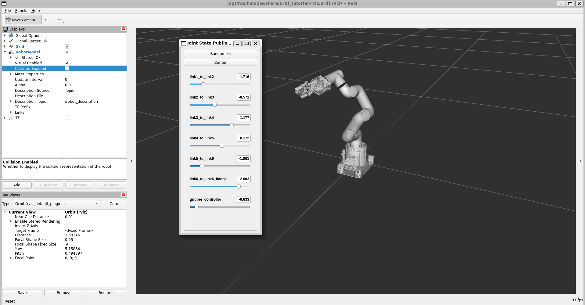

# MyCobot ROS 2 Humble Simulation

This repository contains the URDF and simulation files for the MyCobot robotic arm. 

## 🎥 Project Preview


*Watch the full demo video in the docs folder!*

## 🛠 Built With
- **ROS 2 Humble**
- **Xacro** (Modular URDF)
- **RViz2** for visualization

## 🚀 How to Run
1. Clone this repo into your `src` folder.
2. Build the workspace: `colcon build`.
3. Source: `source install/setup.bash`.
4. Launch:
   ```bash
   ros2 launch urdf_tutorial display.launch.py model:=$(ros2 pkg prefix mycobot_description)/share/mycobot_description/urdf/robots/mycobot_280.urdf.xacro

 ## 📜 Acknowledgments
This project was developed while following the excellent tutorial series by **Addison Sears-Collins** at [Automatic Addison](https://automaticaddison.com/). 

Specifically, I used the following guide as a foundation for the URDF structure:
* [Create and Visualize a Robotic Arm with URDF – ROS 2 Jazzy](https://automaticaddison.com/create-and-visualize-a-robotic-arm-with-urdf-ros-2-jazzy/)

*Note: While following the guide, I adapted the configuration for the MyCobot 280 and resolved environment-specific pathing and dependency issues.*
